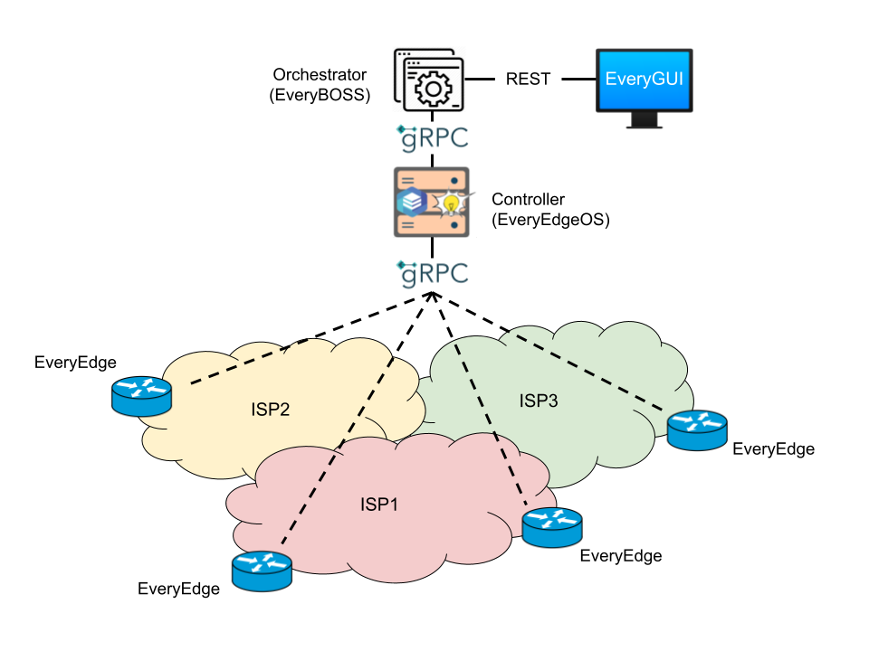

# EveryWAN documentation

This repository contains the documentation and the deployment instructions of the EveryWAN project.

EveryWAN is an open source SD-WAN solution. 

## Architecture

The architecture of EveryWAN is composed of several components as shown in the figure below.

**EveryEdge** is a network function (either physical or virtual) that is placed at an enterprise's branch. EveryEdge establish interconnections to connect the branches of an enterprise each other.

**EveryEdgeOS** is an SD-WAN Controller that leverages a Zero Touch Provisioning (ZTP) approach to program and control the EveryEdges. It interacts with the EveryEdges through an interface based on the gRPC protocol and takes care of many aspects of the initial device registration, authentication and configuration.

**MongoDB** (not shown in the figure) is a NoSQL document-oriented database used to store information about the EveryEdges and the SD-WAN services (e.g., overlay networks, VPNs, ...).

**EveryBOSS** is an SD-WAN Orchestrator. It automates the configuration of the EveryEdges and the deployment of the SD-WAN services.

**Keystone** (not shown in the figure) is an identity service used for authentication. It leverages a **MariaDB** database to store user accounts information.

**EveryGUI** is a NGINX webserver that offers a GUI through which the users can configure the EveryEdges and create SD-WAN services. EveryGUI interacts with EveryBOSS through a REST API to implement the requests made by the users.

A full description of EveryWAN can be found [here](http://netgroup.uniroma2.it/Stefano_Salsano/papers/21-everywan-iceccme.pdf).

## Deployment

There are several options to deploy EveryWAN. If you want to try EveryWAN and are undecided which option to choose, we recommend the **Option 1** as it is the fastest way to deploy and test SD-WAN services.

### Option 1 - EveryEdge Virtual Machine

We have a public deployment of the management infrastructure (EveryGUI, Keystone, MariaDB, and EveryBosS) and control plane components (EveryEdgeOS and MongoDB) on a server in Tor Vergata.

If you want to try EveryWAN, you can [download a ready-to-go virtual machine (VM) image]() and import the VM image in an type 2 hypervisor like VirtualBox or VMware. On the first boot a wizard will assist you in configuring EveryEdge.

### Option 2 - EveryEdge Docker container (not yet ready)

Work in progress. We are working on a Dockerized version of EveryEdge. The Docker image will be released soon.

### Option 3 - Self-hosted EveryWAN infrastructure

You can host the entire EveryWAN infrastructure on your own server(s). To deploy your self-hosted EveryWAN infrastructure, follow the instructions at [everywan-deployment (EveryEdgeOS (EveryWAN controller) and management infrastructure)](https://github.com/cscarpitta/everywan-deployment#everyedgeos-everywan-controller-and-management-infrastructure).

### Option 4 - Development environment

We have also an open source development environment. This environment relies on an EveryWAN emulator based on the Mininet project that we use to develop and test functionalities. If you want to contribute to EveryWAN, you can install the development on a Linux machine and start developing.

You can found the instructions to run the development environment [here](https://github.com/everywan-io/everywan-deployment/blob/master/development-environment/README.md).